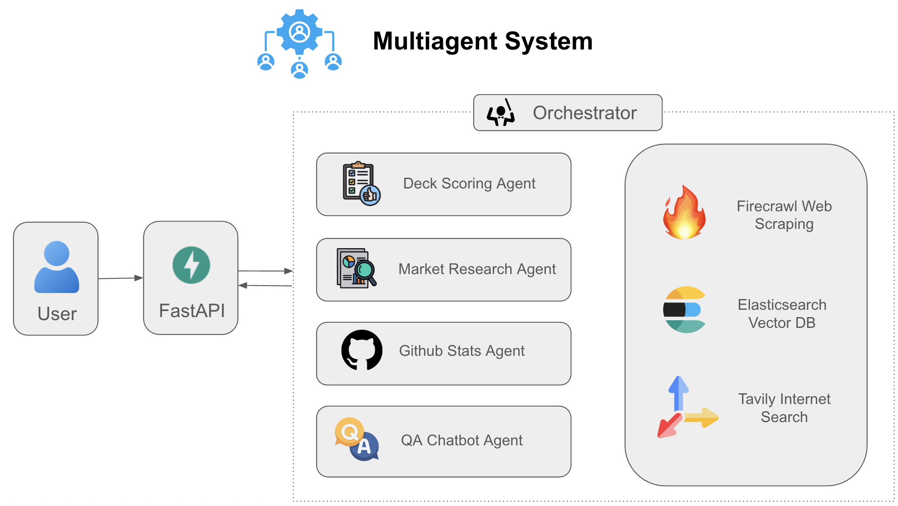
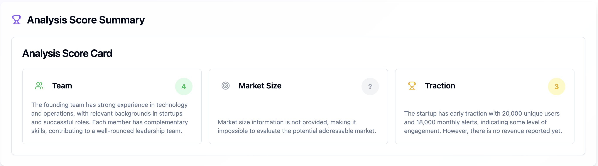
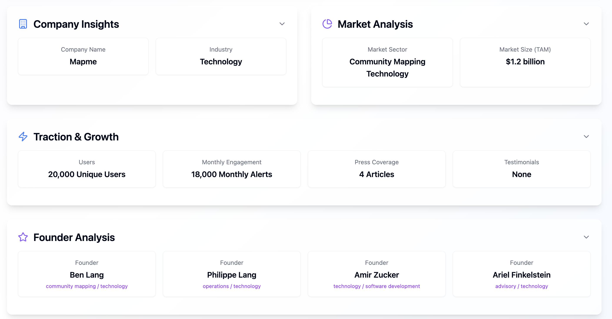

# 🚀 Deck Insight

**Deck Insight** is an open-source AI tool to **analyze, summarize, and score startup pitch decks** automatically.

- 📄 Upload a startup's pitch deck (PDF)
- 📋 Extracts and structures key information
- 🏆 Scores the startup based on a **custom evaluation rubric** (for investors, accelerators, competition judges)
- 🌎 Calculates **market size** estimates from real-time internet data
- 🛠️ Pulls insights from the startup’s GitHub repositories (for developer tools/open-source startups)
- 💬 Includes a **QA chatbot** to ask natural language questions about the startup

Fully extensible and customizable for your workflows.  
Perfect for investors, analysts, startup competitions, accelerators, and ecosystem builders.



Observability on AI agents are implemented through LangSmith.

---

## 🛠 Output Preview

> **Note**: This repository contains only the backend implementation. The screenshots below are from a separate frontend integration built using [Lovable](https://lovable.dev), showcasing how the API endpoints can be consumed and displayed in a user interface.





---

## 🛠 How It Works

1. Upload or provide a link to the startup’s pitch deck (PDF).
2. The system extracts key information and fills a structured profile.
3. Applies a scoring rubric customized to your preferences.
4. Estimates market size from online data sources.
5. (Optional) If it's a developer tool, pulls additional GitHub repo data.
6. Ask the built-in chatbot for any questions about the startup profile.

---

## 📦 Installation

1. Clone the repository:
```bash
git clone https://github.com/hitesh-ag1/deck-insight.git
cd deck-insight
```

2. Create and activate a virtual environment:
```bash
python -m venv venv
source venv/bin/activate
```

3. Install the dependencies
```bash
pip install -r requirements.txt
```

4. Set up the environment variables:
```bash
cp .env.example .env
```
Add your API keys to .env

5. Run FastAPI server:
```bash
uvicorn main:app --reload
```

6. Test the API with sample decks under ```examples``` folder:
```bash
# Use any deck from the examples/ directory to test
curl -X POST "http://localhost:8000/analyze-complete" \
  -H "Content-Type: application/json" \
  -d '{"file_path": "examples/MapMe-Pitch-Deck.pdf"}'

# Or use the Swagger UI at http://localhost:8000/docs to test interactively
```
---


## 🏗️ How It’s Built

**Startup Deck Copilot** is architected using modular AI agents orchestrated with the [LangGraph](https://langgraph.readthedocs.io/) framework, all packaged behind a FastAPI server for easy deployment and API access.

### ✨ Core Components

- **Pitch Deck Scorer**  
  - Inputs images of pitch deck slides
  - Uses **Gemini 2.0 Flash** for OCR and visual understanding
  - Generates a structured summary of key startup information (problem, solution, traction, market, business model, team, funding) using **GPT-4o-mini**
  - Scores the startup against a predefined, customizable rubric

- **Market Research Agent**  
  - Uses Tavily Search to research sector, market size, and competitor landscape
  - Summarizes search results using **GPT-4o-mini**

- **GitHub Viewer Agent**  
  - Uses Firecrawl to scrape the startup’s GitHub repositories
  - Summarizes repository activity, health, and community engagement

- **QA Chatbot**  
  - Built as a Retrieval-Augmented Generation (RAG) system
  - Indexes startup profiles into Elasticsearch
  - On query, retrieves most relevant context and answers using **GPT-4o-mini**

- **Supervisor Agent**  
  - Orchestrates the full analysis pipeline:
    1. **Pitch Deck Scorer**
    2. **Market Research Agent**
    3. **GitHub Viewer Agent** (conditional)

---

### 🛠️ Stack

| Layer | Technology |
|:---|:---|
| Vision Model | Gemini 2.0 Flash |
| Language Model | GPT-4o-mini |
| Agent Orchestration | [LangGraph](https://www.langchain.com/langgraph) |
| API Server | [FastAPI](https://fastapi.tiangolo.com) |
| Web Search | [Tavily API](https://tavily.com/) |
| Web Scraping | [Firecrawl](https://firecrawl.dev/) |
| Vector Database (RAG) | [Elasticsearch](https://www.elastic.co/elasticsearch/) |


---

## 📚 API Endpoints

- ```POST /analyze-complete```: Full pitch deck analysis
- ```POST /analyze-pitch-deck```: Pitch deck scoring and summary
- ```POST /analyze-market-size```: Market research analysis
- ```POST /analyze-github-repository```: GitHub repository evaluation
- ```POST /chat-assistant```: Interactive Q&A about the pitch deck

---

## 📂 Project Structure

```
pitch_deck/
├── .env.example         # Example environment variables template
├── README.md             # Project documentation
├── main.py               # FastAPI application entry point
├── requirements.txt      # Project dependencies
├── core/                 # Core functionality and utilities
│   ├── prompts.py        # AI model prompts and templates
│   ├── schema.py         # Shared data models and schemas
│   ├── settings.py       # Application configuration
│   └── utils.py          # Shared utility functions
└── agents/               # AI agents for different analysis tasks
    ├── <agent_name>/     # Each agent has a modular folder
    │   ├── agent.py      # Agent logic and workflow
    │   ├── helpers.py    # Helper functions (optional)
    │   ├── models.py     # Agent-specific data models
    │   └── nodes.py      # LangGraph nodes defining steps
```


---

## 🧩 Future Roadmap

- Advanced financial modeling (projections, valuation sanity checks)
- Comprehensive prompt testing using [Promptfoo](https://github.com/promptfoo/promptfoo)
- API and plugin integrations (e.g., Crunchbase, LinkedIn)
- Chrome extension for sourcing decks from web
- Support for multiple decks comparison

---

*Built with ❤️ to make startup evaluation faster, fairer, and more data-driven.*
